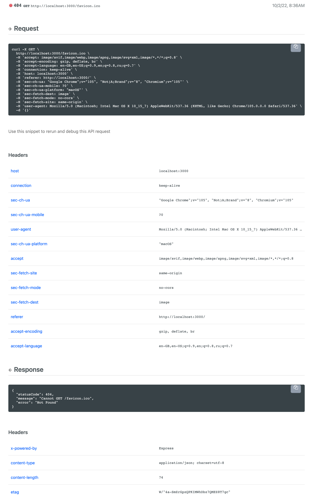

readme-metric-reporter-nestjs / [Exports](modules.md)

# Report Nest.js API usage metrics to [README.com](https://docs.readme.com/docs/api-metrics-in-readme)

Collect and publish Nest.js API usage metrics to README.io

[](https://www.npmjs.com/readme-metric-reporter-nestjs)
[](https://codecov.io/gh/igrek8/readme-metric-reporter-nestjs)


## Installation

```bash
npm install --save readme-metric-reporter-nestjs

yarn add readme-metric-reporter-nestjs
```

## View in the dashboard

<details>
  <summary>Review a request metric</summary>
  
</details>

## Usage

[Example](./src/demo/main.ts)
